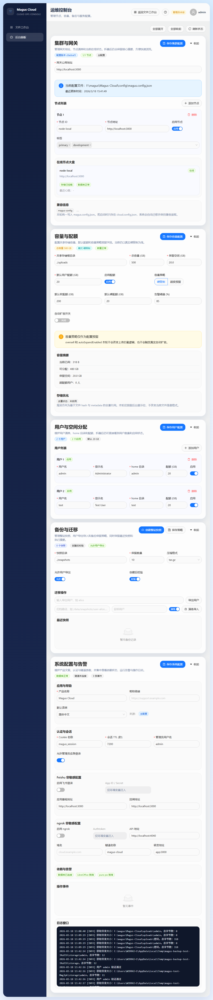
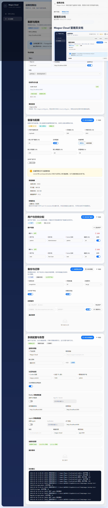

# Magus Cloud

面向团队共享存储场景的轻量云盘控制台。

本项目采用“用户端像网盘产品、管理员端像运维控制台”的分层体验：用户在 `/dashboard` 完成上传、预览、分享和文件管理，管理员在 `/admin` 维护节点、容量、备份与服务配置。

## Preview





## Highlights

- 首页采用接近百度网盘官网的极简首屏：左侧文案、右侧主视觉、一个“去登录”按钮。
- 用户端使用双侧栏工作台结构，保留上传、分享、预览、搜索和新建文件夹能力。
- 管理员端采用矩阵化运维控制台，集中展示集群与网关、容量与配额、用户分配、备份迁移、系统配置与告警。
- 主配置统一写入 `config/magus.config.json`，兼容读取旧的 `config/cloud.config.json`。
- 帮助系统内置在产品右上角，可直接查看用户文档与管理员文档。

## Quick Start

### 1. Install

```bash
npm install
```

### 2. Configure

```bash
cp .env.example .env
```

关键环境变量：

- `MAGUS_DATABASE_URL`
- `MAGUS_ADMIN_USERNAME`
- `MAGUS_ADMIN_PASSWORD`
- `MAGUS_SESSION_SECRET`
- `MAGUS_PUBLIC_APP_URL`
- `MAGUS_PUBLIC_API_URL`
- `FEISHU_APP_ID`
- `FEISHU_APP_SECRET`
- `NGROK_AUTHTOKEN`

### 3. Main Config

主配置文件为 [`config/magus.config.json`](config/magus.config.json)。

主要结构：

- `cluster`
- `storage`
- `users`
- `backup`
- `ui`
- `auth`
- `feishu`
- `ngrok`

说明：

- 服务启动时优先读取 `magus.config.json`
- 如不存在，则读取旧的 `cloud.config.json` 并自动迁移
- 后台保存统一回写 `magus.config.json`
- 密钥类字段仍只来自环境变量

### 4. Run

```bash
npm run build
npm run build:server
npm run start
```

默认访问地址：

```text
http://localhost:3000
```

## Homepage Login Flow

首页 `/` 采用极简首屏：

- 左侧为品牌标题和简短说明
- 右侧为单张主视觉图
- 首屏只保留一个“去登录”按钮

点击“去登录”后会打开登录层：

- 主入口为“使用飞书登录”
- 管理员应急登录位于折叠区

## Docker Compose

仓库中的 [`docker-compose.yml`](docker-compose.yml) 已切换到主配置文件模式：

- `MAGUS_SERVICE_CONFIG=/app/config/magus.config.json`
- `MAGUS_CLOUD_CONFIG=/app/config/cloud.config.json`

启动：

```bash
docker compose up -d --build
```

## Public APIs

- `GET /api/admin/service-config`
- `PUT /api/admin/service-config`
- `GET /api/admin/cloud-config`
- `PUT /api/admin/cloud-config`
- `GET /api/usage`
- `POST /api/create-folder`

## Documentation

- 用户文档：[docs/user-guide.md](docs/user-guide.md)
- 管理员文档：[docs/admin-guide.md](docs/admin-guide.md)

帮助入口位于：

- 首页右上角 `?`
- 用户工作台右上角 `?`
- 管理员后台右上角 `?`

## Test

```bash
npm run build
npm run build:server
npm test
npm run test:e2e
```
